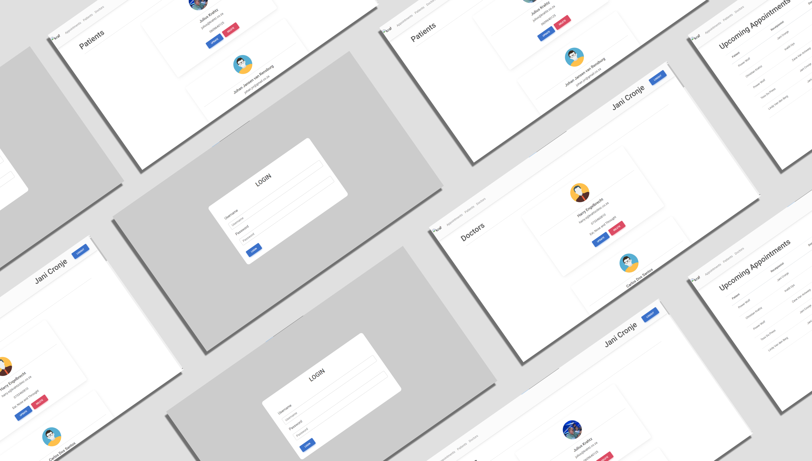
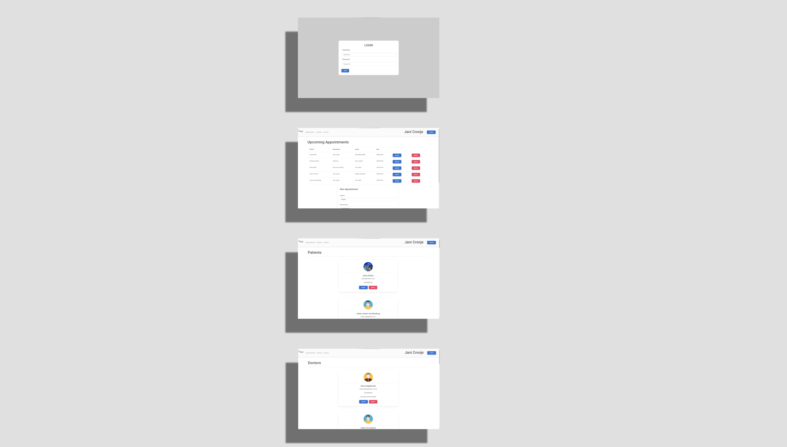
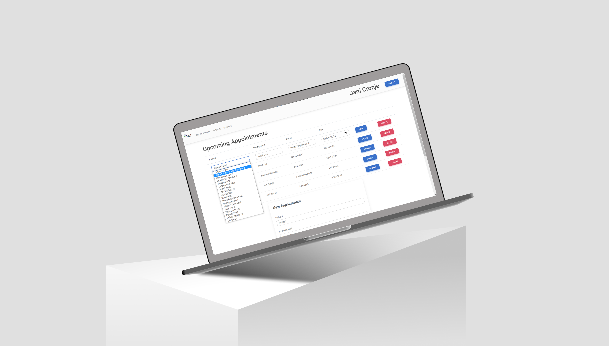

 DV200_Project
 
## About The Project
### Description

 
 In the past, we looked at APIs that ultimately access a repository of data stored in a database. We looked at the most common form of database structure, Structured QWuery Language (SQL).
 For the project, I created my first persistent data system by developing a management portal for a medical practitioner's office.

 This project was built with Visual Studio Code with the help of XAMPP for managing my database.

## Getting Started
### Prerequisites

 In order to have access to the database one requires XAMPP to be installed on your device.

 To download XAMPP you can simply click the link <a href="https://www.apachefriends.org/">here</a>

## Features And Functionality

 On the index page you won't be able to go to a different page without logging in first. in order to see the other pages you will need to log in with the correct information otherwise you will be given an error that tells you what information field is wrong or missing. When the detail of the user is correct they will be redirected to the home page where the appointments are shown. in the navigation bar, the name of the receptionist that is logged in will be displayed and shown on all pages' navigation bar.

 On all the pages you will be able you update/ delete/ create and read the data from my database. On the appointment/home page, the information that can be updated or created uses a select option element that sends the value to the database and not the names selected.

On the other two pages (patients and doctors) the receptionist can update the images of the users and that image is saved in the database and in your local files.

When a receptionist is done she/he can click on the Logout button and will be redirected to the login page and will need to sign in again to view the other pages or to make changes.

## Concept Process
<h3>Ideation</h3>

For my inspiration I looked at Mediclinic and the way they display information about doctors and how they are displayed. Click <a href="https://www.mediclinic.co.za/en/corporate/find-a-doctor.html">here</a> to view.

<h3>Wireframes</h3>

## Development Process
### Implementation Process

I started off with setting up my database and adding information I will be required to use in the project. After the database was setup and ready to use I started off with creating a single page where i will be able to display on the page and then I moved it to be displayed as a card. When the read worked for the page I made duplicated of the page and edited it to suite my needs and to display the corresponding data on the pages.

Now that all the pages can read the data from the database I add the code and functionality to create a new user and when that wored I implemented the delete functionality to work with the palceholder data I created with the add functionality. Now that the delete and add worked I added the update functionality till it worked and with that working I copied the code I used for the add, delete, and update and implemented it to work with the other pages and their relevant information.

Now that the CRUD functionality works I worked on the appointment page to display the relevant names that is linked in the appointments table and made it that you can see the name of the corresponding ID that is saved in database. When you update a appointment you will be given the names of all the doctor and the patient as well as the receptionist. When the information on the appointment page worked and displayed as I wanted it to. The login page I created last of everything and just before that I made the functionality work with help to add and update an image in the database and to display the correct image with the corresponding data.

<h3>Highlights</h3>
<ol>
 <li>The bigest highlight for me was getting the information on the appointment page to display the names of the poeple that is assosiated with the appointments.</li>
 <li>Having a working image display, update, and store in correct places.</li>
 <li>A functional Login page with functionality.</li>
</ol>
<h3>Challenges</h3> 
<ol>
 <li>Having the Image store in the correct places (database and localfiles)</li>
 <li>Having the Image display</li>
 <li>Appointment page to display the names and not their IDs</li>
</ol>

## Future Implementation

I would like to implemnt a functionality sothat only one receptionist can edit, add, and delete other receptionist and to have the others restricted access to the information.

## Final Outcome
### Mockups

## Walkthrough
<video>
 <source src="video/Term2_Walkthrough.mp4" type="video/mp4">
</video>

You can view the walkthough video <a href="https://drive.google.com/file/d/1XKKRfIpnKq1JE6oaX41Hi-ZQBklt2A5m/view?usp=sharing">here</a>

## Video Demonstration

You can view the demonstration video <a href="https://drive.google.com/file/d/1lEulpf_K2HweDqd7slhcVOExBGD-GI_S/view?usp=sharing">here</a>

## Conclution

In this project I have learned a lot wat you can accomplish with the use of PHP and My SQL and how it can make the work load a lot less even though we had to think a bit more on ways to solve our errors.

